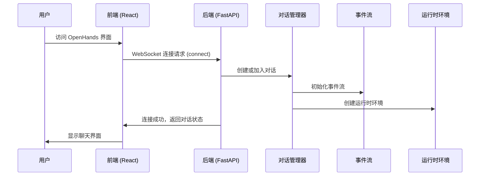
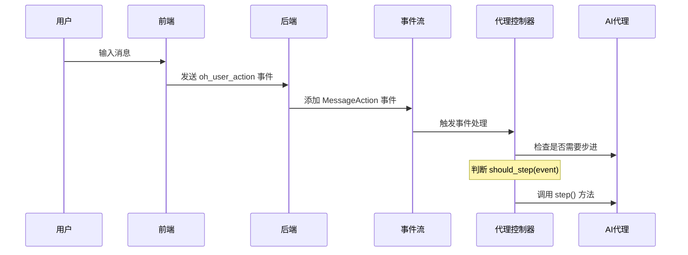
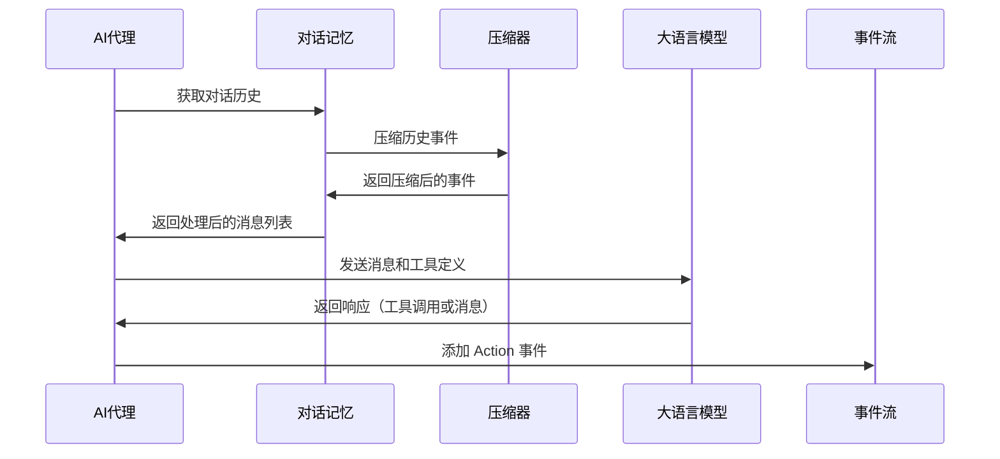
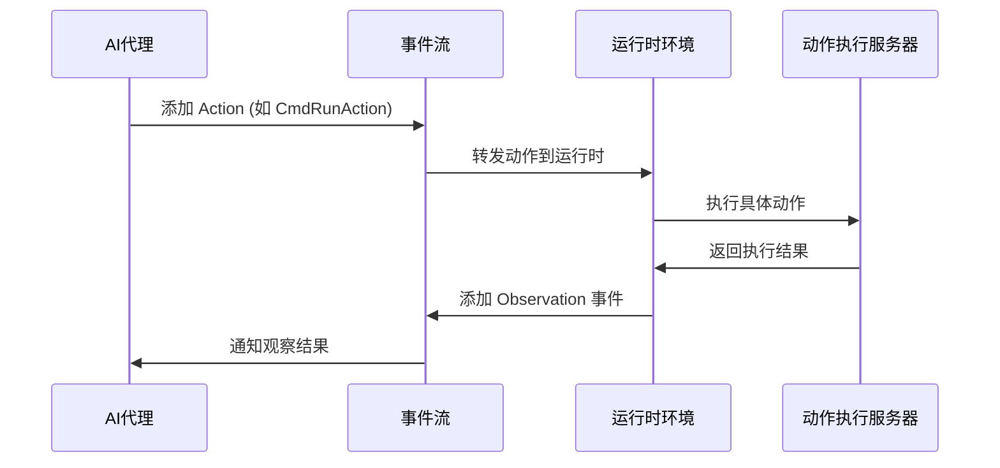
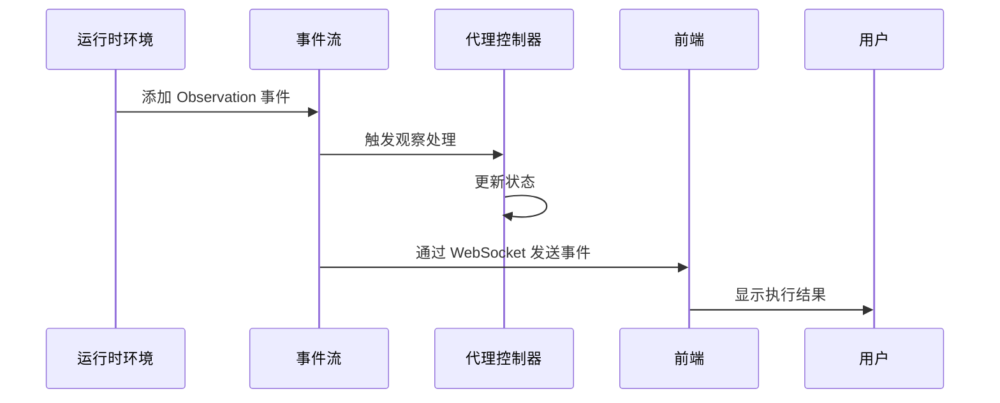
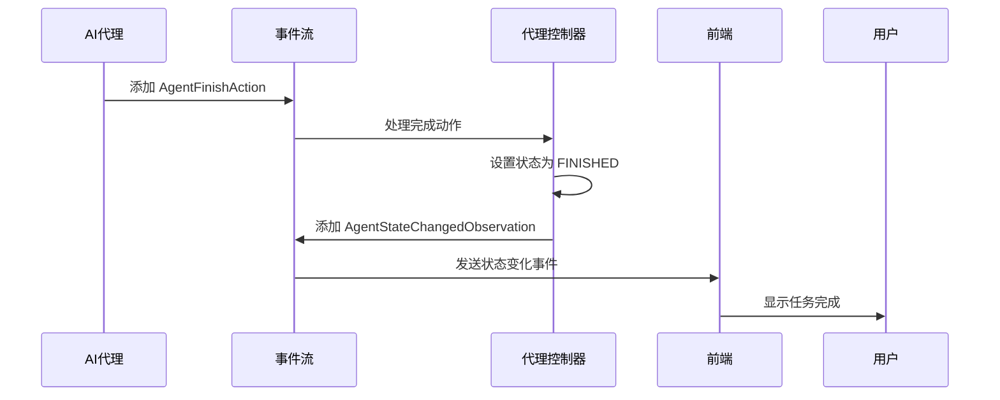

# OpenHands 一次对话的数据流过程

## 概述

OpenHands 是一个多代理的AI软件工程师系统，采用事件驱动的架构。一次对话包含用户与AI代理之间的完整交互过程，从用户输入到代理响应，再到任务完成。

## 核心组件架构

```
┌─────────────────┐    ┌─────────────────┐    ┌─────────────────┐
│   Frontend      │    │   Backend       │    │   Runtime       │
│   (React)       │    │   (FastAPI)     │    │   (Docker/Local)│
└─────────────────┘    └─────────────────┘    └─────────────────┘
         │                       │                       │
         │ WebSocket             │ HTTP/WebSocket        │ Action Execution
         │                       │                       │
    ┌────▼────┐              ┌───▼───┐              ┌────▼────┐
    │ Chat UI │              │ Server│              │ Runtime │
    └─────────┘              └───────┘              └─────────┘
```

## 详细数据流程

### 1. 连接建立阶段



**关键代码位置：**
- 前端连接：`frontend/src/services/`
- WebSocket 处理：`openhands/server/listen_socket.py`
- 对话管理：`openhands/server/conversation_manager/`
- 事件流：`openhands/events/stream.py`

### 2. 用户消息处理阶段



**关键数据结构：**
```python
# 用户消息事件
MessageAction(
    content="用户输入的内容",
    source=EventSource.USER,
    timestamp="2024-01-01T00:00:00",
    image_urls=[]  # 可选的图片URL
)
```

### 3. 代理处理阶段



**关键代码位置：**
- 代理步进：`openhands/agenthub/codeact_agent/codeact_agent.py:step()`
- 对话记忆：`openhands/memory/conversation_memory.py`
- 事件压缩：`openhands/memory/condenser/`

### 4. 动作执行阶段



**常见的动作类型：**
- `CmdRunAction`: 执行 bash 命令
- `IPythonRunCellAction`: 执行 Python 代码
- `FileEditAction`: 编辑文件
- `BrowseURLAction`: 浏览网页
- `MessageAction`: 发送消息
- `AgentFinishAction`: 完成任务

### 5. 观察结果处理阶段



**观察结果类型：**
- `CmdOutputObservation`: 命令执行输出
- `IPythonRunCellObservation`: Python 代码执行结果
- `FileEditObservation`: 文件编辑结果
- `ErrorObservation`: 错误信息
- `AgentStateChangedObservation`: 代理状态变化

### 6. 循环迭代阶段

```mermaid
graph TD
    A[接收到 Observation] --> B{代理状态检查}
    B -->|RUNNING| C{是否需要继续步进?}
    B -->|PAUSED/STOPPED| D[等待用户输入]
    C -->|是| E[调用 Agent.step()]
    C -->|否| F[等待下一个事件]
    E --> G[生成新的 Action]
    G --> H[执行 Action]
    H --> I[产生 Observation]
    I --> A
    D --> J[用户输入新消息]
    J --> A
```

### 7. 任务完成阶段



## 核心数据结构

### Event 事件基类
```python
@dataclass
class Event:
    id: int                    # 事件ID
    timestamp: str            # 时间戳
    source: EventSource       # 事件来源 (USER/AGENT/ENVIRONMENT)
    message: str             # 事件消息
    cause: int | None        # 引起此事件的事件ID
```

### Action 动作类
```python
@dataclass
class Action(Event):
    runnable: bool = False   # 是否可执行
    # 具体动作类型会有不同的字段
```

### Observation 观察类
```python
@dataclass
class Observation(Event):
    content: str            # 观察内容
    # 具体观察类型会有不同的字段
```

### State 状态类
```python
class State:
    agent_state: AgentState          # 代理状态
    history: list[Event]             # 事件历史
    iteration: int                   # 当前迭代次数
    max_iterations: int              # 最大迭代次数
    inputs: dict                     # 输入参数
    outputs: dict                    # 输出结果
    metrics: Metrics                 # 性能指标
```

## 关键组件说明

### EventStream 事件流
- **作用**: 管理所有事件的流转和存储
- **特点**: 线程安全，支持订阅者模式
- **位置**: `openhands/events/stream.py`

### AgentController 代理控制器
- **作用**: 管理代理的生命周期和状态
- **功能**: 事件处理、状态管理、异常处理
- **位置**: `openhands/controller/agent_controller.py`

### ConversationManager 对话管理器
- **作用**: 管理对话的创建、连接和断开
- **实现**: 支持单机和集群模式
- **位置**: `openhands/server/conversation_manager/`

### Runtime 运行时环境
- **作用**: 提供代码执行环境
- **类型**: Docker、本地、远程等
- **位置**: `openhands/runtime/`

### Memory 记忆系统
- **作用**: 管理对话历史和上下文
- **组件**: ConversationMemory、Condenser
- **位置**: `openhands/memory/`

## 数据持久化

### 事件存储
- **EventStore**: 存储所有事件到文件系统
- **格式**: JSON 格式，按页存储
- **位置**: `openhands/events/event_store.py`

### 对话存储
- **ConversationStore**: 存储对话元数据
- **支持**: 本地文件、云存储
- **位置**: `openhands/storage/conversation/`

### 设置存储
- **SettingsStore**: 存储用户设置
- **位置**: `openhands/storage/settings/`

## 错误处理和恢复

### 异常类型
- `LLMResponseError`: LLM 响应错误
- `AgentStuckInLoopError`: 代理陷入循环
- `LLMContextWindowExceedError`: 上下文窗口超限

### 恢复机制
- 自动重试机制
- 状态回滚
- 错误观察事件

## 性能优化

### 事件压缩
- **Condenser**: 压缩历史事件以节省 token
- **策略**: 截断、摘要、智能选择

### 内存管理
- **分页存储**: 事件按页存储到磁盘
- **缓存机制**: 热点数据内存缓存

### 并发处理
- **异步处理**: 使用 asyncio 处理并发
- **线程池**: 处理 CPU 密集型任务

## 总结

OpenHands 的对话数据流是一个复杂的事件驱动系统，通过以下关键步骤完成一次完整的对话：

1. **连接建立**: WebSocket 连接，初始化对话环境
2. **消息接收**: 用户输入转换为 MessageAction 事件
3. **代理处理**: AI 代理分析历史，调用 LLM 生成响应
4. **动作执行**: 在运行时环境中执行具体动作
5. **结果观察**: 收集执行结果，生成 Observation 事件
6. **状态更新**: 更新代理状态，准备下一轮迭代
7. **循环迭代**: 重复步骤 3-6 直到任务完成
8. **任务完成**: 代理发送 AgentFinishAction，结束对话

整个过程通过事件流进行协调，确保了系统的可扩展性、可维护性和可观测性。
